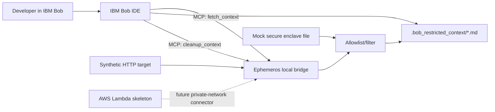

<p align="center">

</p>

<p align="center"> 
   
   
   
   
   
</p>

## ephemeral | *adj. /ɪˈfɛmərəl/*


> **Lasting for only a short time; fleeting; transitory.**

Ephemeros is a proof-of-concept for an **Ephemeral Context Bridge** for IBM Bob, which currently does not automatically have access to private enterprise schema or VPN-only systems. Bob can access those systems only if a developer/team configures an MCP tool or other approved integration. 

Ephemeros *is* that scoped MCP bridge.

## Abstract

AI coding assistants are incredibly powerful, but they are blind to the enterprise reality. Proprietary trading algorithms, sensitive company info, internal APIs, and legacy databases, all live behind corporate firewalls. IT security will not authorise permanent VPN tunnels for AI agents. This leaves developers manually copying and pasting sensitive context across network boundaries, entirely defeating the purpose of an integrated IDE workflow.

Sure, a company could build a bespoke, in-house LLM for safe internal use. However, the massive financial investment, maintenance overhead, and uncertain ROI make this an impractical reality for most.

Ephemeros bridges this gap with a zero-trust architecture. It is an Ephemeral Context Bridge that grants IBM Bob just-in-time, temporary access to restricted enterprise data, securely delivering context exactly when it is needed.

This idea aims to fulfill a small but crucial requirment: **AI tools such as Bob should be able to ask for one piece of restricted context, use it, and then lose access to it.** No permanent VPN tunnel. No broad indexing of private systems. No raw private page body stored in logs. Developers unlock the full capability of IBM Bob natively in their IDE, whilst IT security maintains absolute infrastructural control. 

## How it works
* **Trigger:** The developer asks IBM Bob to write code that requires knowledge of specific internal context.
* **Fetch:** Bob calls the Ephemeros MCP tool, which opens a temporary, highly scoped connection to retrieve only the explicitly requested schema or documentation.
* **Destroy:** Ephemeros writes the filtered context locally for Bob to read, generates the code, and instantly wipes the temporary file while severing the connection.

*(Note: For this 48-hour proof-of-concept, the restricted network is simulated using synthetic data to demonstrate the architectural flow without requiring live corporate credentials.)*

## Key Points

- IBM Bob can use MCP tools to request missing enterprise context.
- Ephemeros writes only the filtered context Bob needs.
- The temporary context file is removed after use.
- A Tailscale/local HTTP target proves the network reachability part without using real private data.
- watsonx.ai filtering is optional; the main demo works offline with a deterministic local filter.

## Main Demo

Use this path for judging:

```powershell
npm.cmd install
npm.cmd test
npm.cmd run lint
npm.cmd run demo:mcp
npm.cmd run demo:secure
```

For the Tailscale reachability proof, first serve the synthetic target file:

```powershell
npm.cmd run serve:vpn-target
```

Then, in another terminal:

```powershell
npm.cmd run demo:tailscale-files
```

This writes clear proof files under `bob_sessions/`:

- `demo-tailscale-target-output.txt`: the HTTP target body.
- `demo-tailscale-bridge-output.txt`: the Bob-facing bridge flow.
- `demo-tailscale-combined-output.txt`: both parts in one report.
- `demo-tailscale-context.md`: safe context written for Bob before cleanup.

Open the target in Chrome:

[http://100.82.136.35:8080/ephemeros-vpn-health.txt](http://100.82.136.35:8080/ephemeros-vpn-health.txt)

Local fallback:

[http://127.0.0.1:8080/ephemeros-vpn-health.txt](http://127.0.0.1:8080/ephemeros-vpn-health.txt)

Expected target body:

```text
Ephemeros VPN reachability proof, 
blablabla tung tung tung sahur.
67.
Remote body is not stored or sent to Bob by the VPN connector.
```

## How Bob Fits

Bob, now equipped with Ephemeros, becomes the active operator that's driving the entire process. 

1. Developer asks Bob to write code that needs internal schema.
2. Bob calls the Ephemeros MCP tool `fetch_context`.
3. Ephemeros checks the requested resource and writes a small markdown file under `.bob_restricted_context/`.
4. Bob reads that file and generates code with the correct table and column names.
5. Bob calls `cleanup_context`.
6. The temporary context file is removed.

*Note: The local script `npm.cmd run demo:mcp` also runs the same flow without spending Bob credits.*

## Architecture



## Current Implementations

- MCP server with `fetch_context` and `cleanup_context`.
- Express fallback API with `/health`, `/fetch-context`, and `/cleanup`.
- Zod request validation.
- Safe context file writing with path-safe context IDs.
- Payload byte caps.
- Synthetic restricted dataset.
- Local deterministic filter.
- Optional watsonx.ai filter using Granite.
- AWS Lambda skeleton for a future private-network connector.
- Tailscale/local target demo.
- Vitest tests, ESLint, dependency check, secret scan, and compliance scan.

## Important Files

```text
src/mcpServer.js                 Bob MCP integration
src/server.js                    Express fallback API
src/bridgeService.js             Shared fetch/write/cleanup flow
src/mockRestrictedContext.js     Synthetic connector dispatcher
scripts/demo-mcp-flow.js         Local Bob-like MCP demo
scripts/demo-tailscale-output-files.js
                                  Tailscale/local proof output generator
vpn-target/ephemeros-vpn-health.txt
                                  Synthetic target body
data/synthetic-restricted-context.json
                                  Bring-your-own synthetic schema
mock-secure-enclave/proprietary_data.txt
                                  Synthetic secure-enclave export
bob_sessions/                    Bob session reports and safe demo output
```

## Optional watsonx.ai Demo

Only use this if credentials are available:

```powershell
Copy-Item .env.example .env
# Fill IBM_API_KEY and WATSONX_PROJECT_ID in .env
npm.cmd run demo:watsonx
```

The local guard still checks the model output before Bob sees it.

## NUS VPN Note

NUS FortiClient support was tried, but SSO and internal page access were too brittle for a clean recorded demo T_T. Wanted to leave it here in case I ever wanted to pick this project up in the future and try implementing it. 

rest in peace my granny she got hit by a bazooka

## Verification

Current verification target:

```powershell
npm.cmd test
npm.cmd run lint
npm.cmd run demo:mcp
npm.cmd run demo:secure
npm.cmd run demo:tailscale-files
npm.cmd run check:deps
npm.cmd run check:secrets
npm.cmd run check:compliance
npm.cmd audit --audit-level moderate
```
